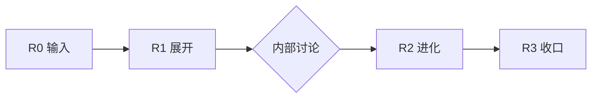

# 三轮体验流 · iPitch

> 给其他用户用的「舒服界面」逻辑。内核可被 grill；界面只问该问的。

---

## 总览



| 轮 | 谁主导 | 感觉像什么 |
|----|--------|------------|
| R0 | 用户 | 「我只记得公司名和几个传闻」 |
| R1 | 系统 | 「帮我挖透了，给刀子和可能的 iPod」 |
| R2 | Sales lead | 「我补一手现场，帮我把产品和货架拼出来」 |
| R3 | 双方 | 「预算说清，iPod 值得破格，货架能落地」 |

---

## R0 · 起手（30 秒）

**收集**

- 目标公司 / 品牌（必填）
- 零散要点（可选，明确标 **未经证实**）
- 见面场景、时长、我方身份（可选）

**不做**

- 不要求 MEDDIC 全表
- 不要求选 account / pitchvision

**产出**：`cases/{slug}/00_charter.md`（用 `references/round0_intake.md`）

**界面文案示例**

> 告诉我们客户是谁，以及你听到的任何碎片——哪怕只是传闻。我们会先研究，再给你能拿去开会的东西。

---

## R1 · 展开（系统跑研究）

**自动**

1. 时效叙事 + 溯源表
2. 冰山研究（`research/`）
3. 张力 → **一把刀**（account）或 **打到心里的 variant 叙事**
4. 若值得造品类：**≥1 个 iPod 概念**（战略案 ≥2），供 sales lead 与内部讨论

**交付给用户的包（R1 Pack）**

| 文件 | 读者 | 内容 |
|------|------|------|
| `research/` + 摘要 | 策略 / 研究 | 深度报告（水下） |
| `B_knife` 或 `B_vision_knife` | Sales lead | 10 分钟能讲的刀 |
| `pitchvision/*`（若有） | 产品 / 创新 | iPod 概念卡 — **内部，非货架** |
| `handoff_to_sales.md` | Sales | R2 待填清单 + debate 问题 |

**界面文案**

> 第一轮结果：深度报告 + 刀刃（+ 可能的专属 iPod 草案）。请 sales lead 内部过一遍，再回来补一手。

---

## R2 · 进化（Sales 第二次输入）

**Sales 补什么**

- PRIMARY：预算科目、决策链、竞品、客户原话
- 对 R1 刀 / iPod 的 **赞成 / 质疑 / 修正**
- 产品边界：我们卖什么、不能卖什么

**系统再出（R2 Pack）**

1. **进化报告** — 产品是什么、怎么讲
2. **火锅首问 5 句** — 下次见客户该问什么（嵌入报告，不是裸清单）
3. **主 C（1–2 个）** + 买不买卡点映射
4. **货架推荐 2–3 套** — 来自 `references/shelf/`，每套含：
   - 组合逻辑
   - 每个货品特征
   - 为何 fit 该客户画像
5. **明确排除**：货架中 **没有** R1 的 bespoke iPod

**界面文案**

> 你补现场，我们进化一版：该问的问题、该点的菜（货架），和专属 iPod 分开——iPod 是你们的「值得破格」故事，货架是「今年能落地」。

---

## R3 · 收口

**收集**

- 客户预算档（区间即可）
- 是否愿意单独立项 iPod / pilot

**交付（Close Pack）**

| 区块 | 内容 |
|------|------|
| **预算现实** | 货架组合如何落在预算内；缺口怎么谈 |
| **iPod 破格** | 不受预算天花板限制的叙事 — 让客户觉得「牛的产品值得花钱买」 |
| **双轨交付表** | 左：货架各组合客户得到什么；右：iPod 客户得到什么 |
| **唯一 ask** | 一个 pilot / 一次 workshop / 一次决策会 |

**界面文案**

> 最后一轮：预算、破格、清单。客户带走什么，一目了然。

---

## 单案目录（推荐）

```
cases/{slug}/
├── 00_charter.md              R0
├── source_timeliness.md
├── research/                  R1 水下
├── B_knife.md                 R1 刀
├── pitchvision/               R1 iPod（若有，不进货架）
├── handoff_to_sales.md        R1→R2 桥
├── R2_evolved_report.md       R2
├── R2_shelf_recommendations.md
├── R3_close_pack.md           R3
└── html/                      可交付页
```

参考样例（仅 account 轨）：`cases/nio/`（橱窗）· `archive/nio/account-v3/`（旧金标）

---

## 与 Cursor 触发

```
/ipitch start [公司名]           → R0 charter
/ipitch [slug] round1            → R1 全套
/ipitch [slug] round2 [sales笔记] → R2
/ipitch [slug] round3 [预算档]   → R3
/ipitch [slug] account …         → 内核 grill（专家）
/ipitch nio pitchvision both     → iPod 样例
```
